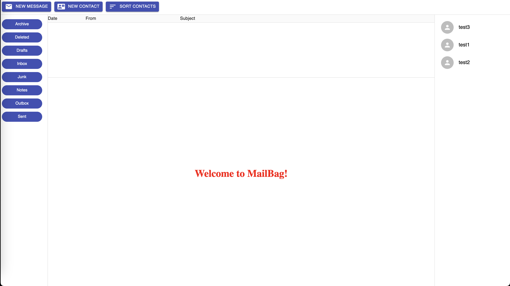
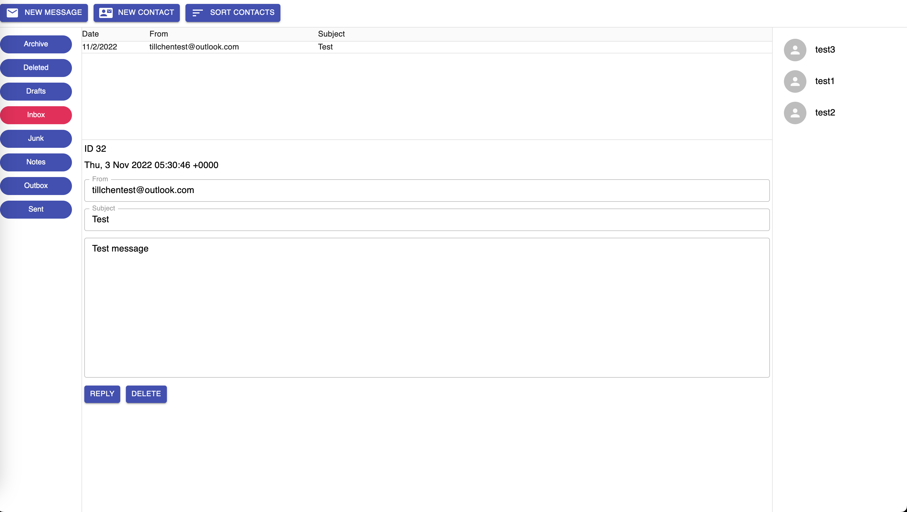
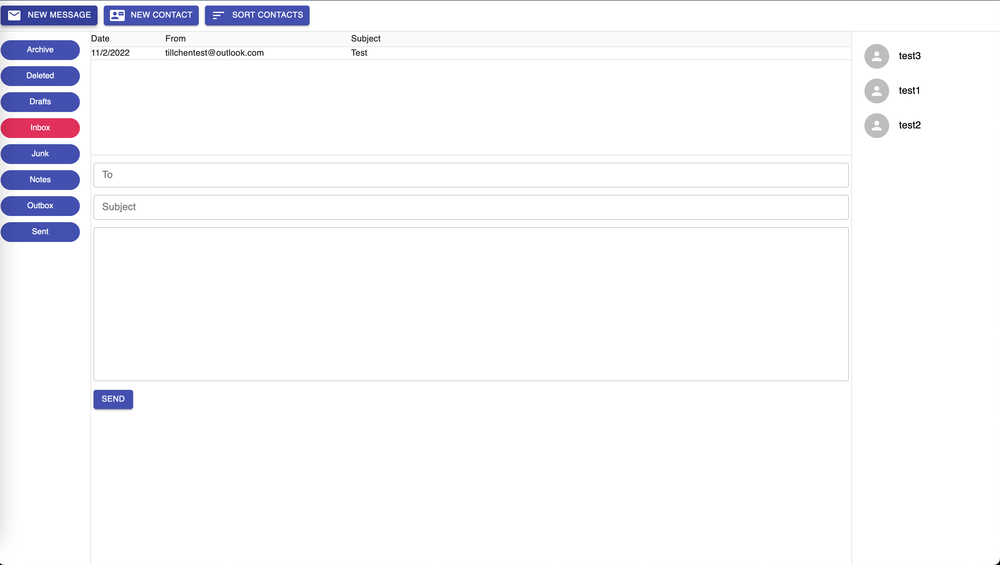
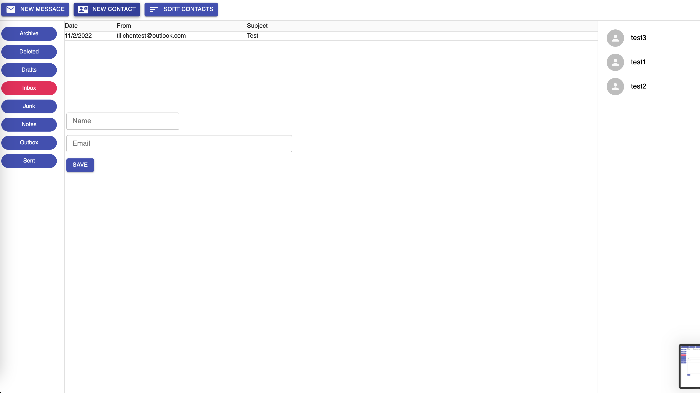
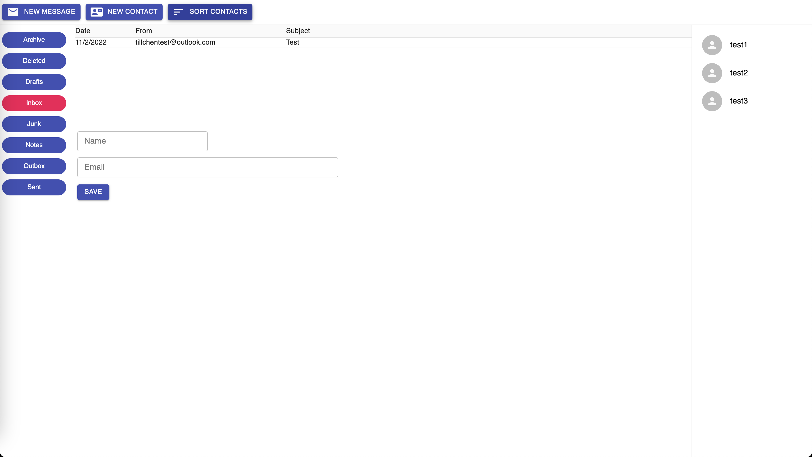
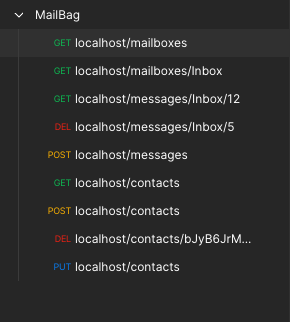

# MailBag

A Webmail system

## Tech Stack

TypeScript, JavaScript, React.js, Node.js, Webpack, AJAX (Axios), NeDB.

## How to use

Change the server info in `server/serverInfo.json`.

Run the following commands in `/server`:

```shell
npm install
npm run dev
```

Run the following commands in `/client`:

```shell
npm install
npm run build
```

Then go to `http://localhost/` to access MailBag.

## UI











## REST APIs



## References

* Modern Full-Stack Development Using TypeScript, React, Node.js, Webpack and Docker by Frank Zammetti